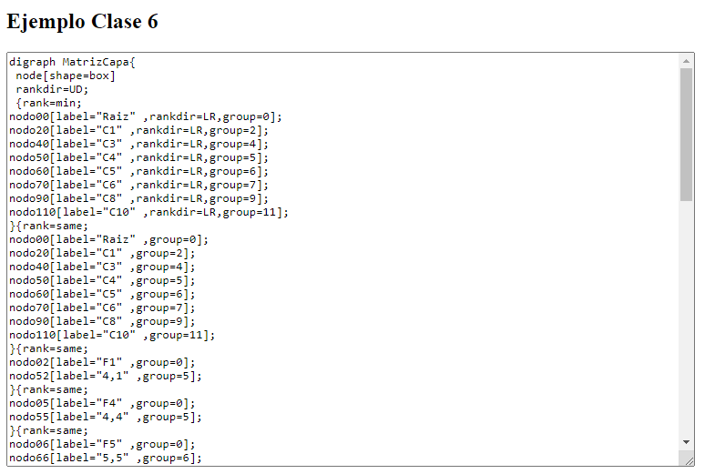
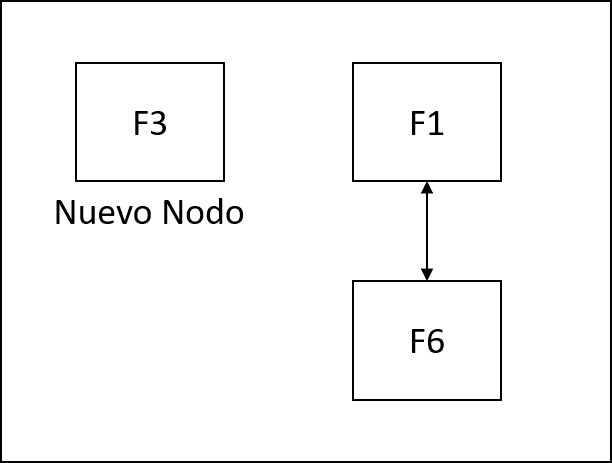
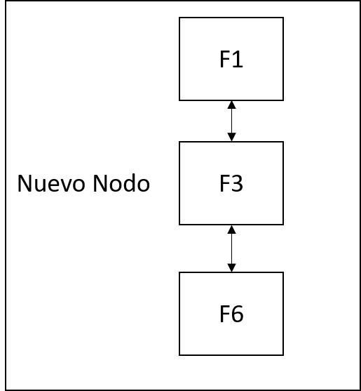
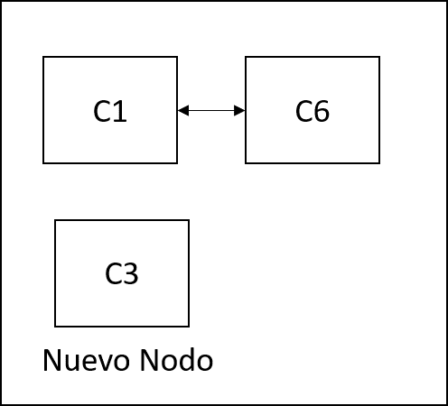
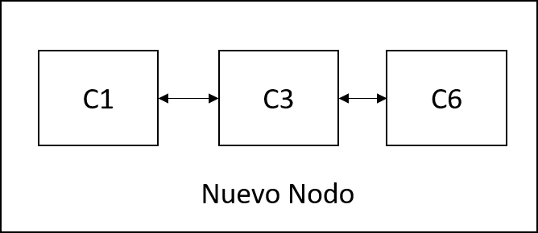

# __Ejemplo Clase 6__

## __Ejemplo de Matriz Dispersa en JS__  

Para el ejemplo de la clase 6 se realizo una matriz dispersa, a continua se explicara cada parte del ejemplo, para corroborar de forma grafica la matriz final se usara la siguiente pagina [Graphviz Online](https://dreampuf.github.io/GraphvizOnline/), solo copiaremos el codigo que nos devolvera la pagina sencilla en html llamada __clase6.html__   


## __Clase nodoMatriz__
Esta sera nuestra clase con la cual llevaremos el control de los nodos que posea nuestra matriz, esta recibira diferentes atributos los cuales seran detallados a continuacion.  
<details>
<summary> Descripcion 🧐</summary>
<br>

Este contara con los atributos __siguiente y anterior__ que seran los punteros para podernos mover a lo largo del eje X, los atributos __abajo y arriba__ que seran los punteros para podernos mover a lo largo del eje Y de la matriz, los atributos __posX y posY__ con ellos podemos llevar control en que posicion de la matriz nos encontramos, seran nuestra forma de llevar el control de las posiciones de los nodos de la matriz, por ultimo el atributo __posicion__ el cual solo almacenara una cadena de texto, en este caso para mostrarnos la posicion que se encuentra el nodo.

``` javascript
    class nodoMatriz{
        constructor(posX, posY, posicion){
            this.siguiente = null;
            this.anterior = null;
            this.abajo = null;
            this.arriba = null;
            this.posX = posX;
            this.posY = posY;
            this.posicion = posicion;
        }
    }
```

</details>


## __Clase Matriz__
Esta sera nuestra clase principal con la cual llevaremos control de todas las funciones que esten relacionadas a la matriz dispersa, las cuales se explicaran a continuacion, se debe dejar que la matriz contara con una raiz, la cual estara en la posicion (-1,-1) que funcionara como raiz o cabeza o principal de la matriz para sus recorridos dentro del eje X como del eje Y.  
``` javascript
    class Matriz{
        constructor(){
            this.principal = new nodoMatriz(-1,-1,"Raiz")
        }
    }
```

### __Funciones que se van a crear dentro de la clase Matriz__

---

### __Funcion buscarF__

<details>
<summary> Descripcion 🧐</summary>
<br>

Esta funcion recibe un parametro que sera la coordenada Y, esta funcion tiene como proposito buscar si la fila ya esta creada en las coordenadas Y, si la fila ya existe este nos devolvera el nodo que encontro, en el caso de que no encuentre el nodo es porque no esta creada aun y devolvera un valor nulo.

``` javascript
    buscarF(y){
        let aux = this.principal
        while(aux){
            if(aux.posY === y){
                return aux;
            }else{
                aux = aux.abajo;
            }
        }
        return null;
    }
```


</details>

### __Funcion buscarC__

<details>
<summary> Descripcion 🧐</summary>
<br>

Esta funcion recibe un parametro que sera la coordenada X, esta funcion tiene como proposito buscar si la columna ya esta creada en las coordenadas X, si la columna ya existe este nos devolvera el nodo que encontro, en el caso de que no encuentre el nodo es porque no esta creada aun y devolvera un valor nulo.

``` javascript
    buscarC(x){
        let aux = this.principal;
        while(aux){
            if(aux.posX === x){
                return aux;
            }else{
                aux = aux.siguiente
            }
        }
        return null;
    }
```


</details>

### __Funcion InsertarFila__

<details>
<summary> Descripcion 🧐</summary>
<br>

Esta funcion recibe dos parametros los cuales son posicion que hace referencencia a la coordenada en Y, y el texto que le enviaremos por default un texto con la siguiente estructura F+posicionY, ejemplo __"F10"__.  
En esta funcion crearemos el nuevo nodo el cual en la coordenada X tendra por default la constante -1 debido a que vamos a movernos nada mas por la coordenada Y partiendo desde la raiz de la matriz, crearemos 2 pivotes, __piv__ que nos ayudara para almacenar el nodo actual donde estemos al momento de movernos por la coordenada Y, __pivA__ que nos ayudara para almacenar el nodo anterior del piv actual. Esta variable __pivA__ se puede omitir, solo teniendo cuidado con los punteros arriba y abajo. Realizamos un ciclo while para buscar la posicion en Y donde se debe crear e insertar la nueva Fila, para esto estaremos comparando lo siguiente:
- Si la posicion en Y del nuevo nodo es mayor a la posicion Y del nodo actual, al ser cierto, solo seguimos recorriendo la coordenada Y.  

- De lo contrario solo hacemos las referencia de los punteros arriba y abajo del nuevo nodo y por ultimo insertamos el nuevo nodo donde corresponde.  


``` javascript
    insertarFila(posicion,texto){
        const nuevoNodo = new nodoMatriz(-1,posicion,texto);
        let piv = this.principal;
        let pivA = this.principal;
        while(piv.abajo){
            if(nuevoNodo.posY > piv.posY){
                pivA = piv;
                piv = piv.abajo;
            }else{
                nuevoNodo.abajo = piv;
                nuevoNodo.arriba = pivA;
                pivA.abajo = nuevoNodo;
                piv.arriba = nuevoNodo;
                return;
            }
        }
        nuevoNodo.arriba = piv;
        piv.abajo = nuevoNodo;
    }
```

</details>

### __Funcion InsertarColumna__

<details>
<summary> Descripcion 🧐</summary>
<br>

Esta funcion recibe dos parametros los cuales son posicion que hace referencencia a la coordenada en X, y el texto que le enviaremos por default un texto con la siguiente estructura C+posicionX, ejemplo __"C10"__.  
En esta funcion crearemos el nuevo nodo el cual en la coordenada Y tendra por default la constante -1 debido a que vamos a movernos nada mas por la coordenada X partiendo desde la raiz de la matriz, crearemos 2 pivotes, __piv__ que nos ayudara para almacenar el nodo actual donde estemos al momento de movernos por la coordenada X, __pivA__ que nos ayudara para almacenar el nodo anterior del piv actual. Esta variable __pivA__ se puede omitir, solo teniendo cuidado con los punteros anterior y siguiente. Realizamos un ciclo while para buscar la posicion en X donde se debe crear e insertar la nueva columna, para esto estaremos comparando lo siguiente:
- Si la posicion en X del nuevo nodo es mayor a la posicion X del nodo actual, al ser cierto, solo seguimos recorriendo la coordenada X.  

- De lo contrario solo hacemos las referencia de los punteros anterior y siguiente del nuevo nodo y por ultimo insertamos el nuevo nodo donde corresponde.  


``` javascript
    insertarColumna(posicion,texto){
        const nuevoNodo = new nodoMatriz(posicion,-1,texto);
        let piv = this.principal;
        let pivA = this.principal;
        while(piv.siguiente){
            if(nuevoNodo.posX > piv.posX){
                pivA = piv;
                piv = piv.siguiente
            }else{
                nuevoNodo.siguiente = piv;
                nuevoNodo.anterior = pivA;
                pivA.siguiente = nuevoNodo;
                piv.anterior = nuevoNodo;
                return;
            }
        }
        nuevoNodo.anterior = piv;
        piv.siguiente = nuevoNodo;
    }
```

</details>


### __Funcion InsertarNodo__

<details>
<summary> Descripcion 🧐</summary>
<br>

Esta funcion recibe 3 parametros, la posicion en X y Y donde insertaremos el nuevo nodo, y el texto en este caso sera posicionX+","+posicionY, ejemplo __"10,10"__.  
Para el flujo de esta funcion primero vamos a crear el nuevo nodo y crearemos 2 variables temporales, esto para hacer el recorrido tanto en X como Y partiendo de la raiz de la matriz.  
Empezaremos a insertar el nodo primero en la posicion X, para esto vamos a crear un primer ciclo para encontrar en el eje X la columna donde vamos a insertar el nuevo nodo, mientras no lo encuentre este solo va a recorrer el Eje X, una vez lo encuentre se detiene el ciclo y el tempX tendra la columna donde se insertara el nuevo nodo. luego de eso crearemos otro ciclo, con este vamos a recorrer el eje Y, para hacer las conexiones de los apuntadores, en este ciclo se puede presentar 3 casos especiales, los cuales son:
- Ya existe un nodo en la posicion de Y, para este caso solo detenemos el ciclo ya que no vamos a sustituirlo.
- Si la posicion de abajo de tempX no es un valor nulo y su coordenada en Y en mayor a la coordenada en Y del nuevo nodo, para este caso solo hacemos la insercion en Y haciendo las conexiones de los apuntadores y terminamos el ciclo.
- Si no existe ningun nodo en la posicion de abajo de tempX, para este caso solo insertamos el nuevo nodo y hacemos las conexiones de sus apuntadores.
- Por ultimo si ninguna condicion se cumple solo sigue recorriendo los nodos de la columna a lo largo del eje Y.  

Luego de esa primera parte, seguimos para insertar el nodo en la posicion Y, para esto vamos a crear un primer ciclo para encontrar en el eje Y la fila donde vamos a insertar el nuevo nodo, mientras no lo encuentre este solo va a recorrer el Eje Y, una vez lo encuentre se detiene el ciclo y el tempY tendra la fila donde se insertara el nuevo nodo. luego de eso crearemos otro ciclo, con este vamos a recorrer el eje X, para hacer las conexiones de los apuntadores, en este ciclo se puede presentar 3 casos especiales, los cuales son:
- Ya existe un nodo en la posicion de X, para este caso solo detenemos el ciclo ya que no vamos a sustituirlo.
- Si la posicion de siguiente de tempY no es un valor nulo y su coordenada en X en mayor a la coordenada en X del nuevo nodo, para este caso solo hacemos la insercion en X haciendo las conexiones de los apuntadores y terminamos el ciclo.
- Si no existe ningun nodo en la posicion de siguiente de tempY, para este caso solo insertamos el nuevo nodo y hacemos las conexiones de sus apuntadores.
- Por ultimo si ninguna condicion se cumple solo sigue recorriendo los nodos de la fila a lo largo del eje X.

``` javascript
    insertarNodo(x,y,texto){
        const nuevoNodo = new nodoMatriz(x,y,texto);
        let tempX = this.principal;
        let tempY = this.principal;
        //Agregar en Columna
        while(tempX.siguiente){
            if(tempX.posX === nuevoNodo.posX){
                break;
            }
            tempX = tempX.siguiente;
        }
        while(true){
            if(tempX.posY === nuevoNodo.posY){
                break;
            }else if(tempX.abajo !== null && tempX.abajo.posY > nuevoNodo.posY){
                nuevoNodo.abajo = tempX.abajo;
                nuevoNodo.arriba = tempX;
                tempX.abajo = nuevoNodo;
                break;
            }else if(tempX.abajo === null){
                nuevoNodo.arriba = tempX
                nuevoNodo.abajo = tempX.abajo
                tempX.abajo = nuevoNodo;
                break;
            }else{
                tempX = tempX.abajo;
            }
        }
        //Agregar en Fila
        while(tempY.abajo){
            if(tempY.posY === nuevoNodo.posY){
                break;
            }
            tempY = tempY.abajo;
        }
        while(true){
            if(tempY.posX === nuevoNodo.posX){
                break;
            }else if(tempY.siguiente !== null && tempY.siguiente.posX > nuevoNodo.posX){
                nuevoNodo.siguiente = tempY.siguiente;
                nuevoNodo.anterior = tempY;
                tempY.siguiente = nuevoNodo;
            }else if(tempY.siguiente === null){
                nuevoNodo.anterior = tempY;
                nuevoNodo.siguiente = tempY.siguiente;
                tempY.siguiente = nuevoNodo;
            }else{
                tempY = tempY.siguiente;
            }
        }
    }
```

</details>

### __Funcion InsertarElemento__

<details>
<summary> Descripcion 🧐</summary>
<br>

Esta funcion recibe 2 parametros, la posicion en X y Y donde insertaremos el nuevo nodo, creamos una variable para el texto del nuevo nodo.  
Luego creamos 2 variables que nos ayudaran para saber si existen o no las columnas y filas dentro de la matriz, para ellos solo mandamos a llamar las funciones correspondientes que se explicaron anteriormente.  
Al darnos sus respectivos resultados cada funcion puede presentarse 4 casos, los cuales son.
- Fila y Columna no existen, para ese caso crearemos primero la columna y fila correspondiente y luego insertamos el nuevo nodo.
- Fila no existe pero Columna si, para este caso solo creamos la fila e insertamos el nuevo nodo. 
- Fila si existe pero Columna no, para este caso solo creamos la columna e insertamos el nuevo nodo.
- Fila y Columna si existen, para este caso solo insertamos el nuevo nodo.

``` javascript
    insertarElemento(x,y){
        let texto = x + "," + y;
        let nuevaFila = this.buscarF(y);
        let nuevaColumna = this.buscarC(x);
        /** Fila y Columna no existen */
        if(nuevaFila === null && nuevaColumna === null){
            this.insertarColumna(x, "C"+x);
            this.insertarFila(y, "F"+y);
            this.insertarNodo(x,y,texto);
        }else if(nuevaFila === null && nuevaColumna !== null){ /* Fila no existe, Columna si existe */
            this.insertarFila(y,"F"+y);
            this.insertarNodo(x,y,texto);
        }else if(nuevaFila !== null && nuevaColumna === null){/* Fila si existe, Columna no existe */
            this.insertarColumna(x, "C"+x);
            this.insertarNodo(x,y,texto);
        }else if(nuevaFila !== null && nuevaColumna !== null){/* Fila si existe, Columna si existe */
            this.insertarNodo(x,y,texto);
        }else{
            console.log("Me dio Ansiedad :(");
        }
    }
```

</details>

### __Ejemplo__

<details open>
<summary> poniendo a prueba el ejemplo 🧐</summary>
<br>

``` javascript
    const matriz = new Matriz();
    /* Elementos no existen */
    matriz.insertarElemento(4,4);
    matriz.insertarElemento(6,6);
    matriz.insertarElemento(8,8);
    matriz.insertarElemento(5,5);
    matriz.insertarElemento(10,10);
    /* fila y columna existen*/
    matriz.insertarElemento(10,8);
    matriz.insertarElemento(8,5);
    /** fila si, columna no */
    matriz.insertarElemento(1,8);
    matriz.insertarElemento(3,8);
    /** fila no, columna si */
    matriz.insertarElemento(4,1);
    matriz.insertarElemento(5,11);
    document.getElementById("ejemplo").innerHTML = matriz.reporte();
```

</details>
